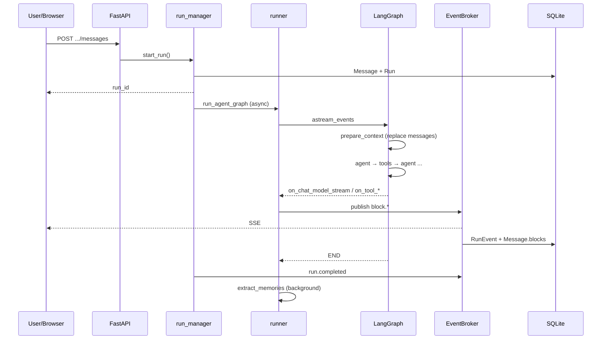
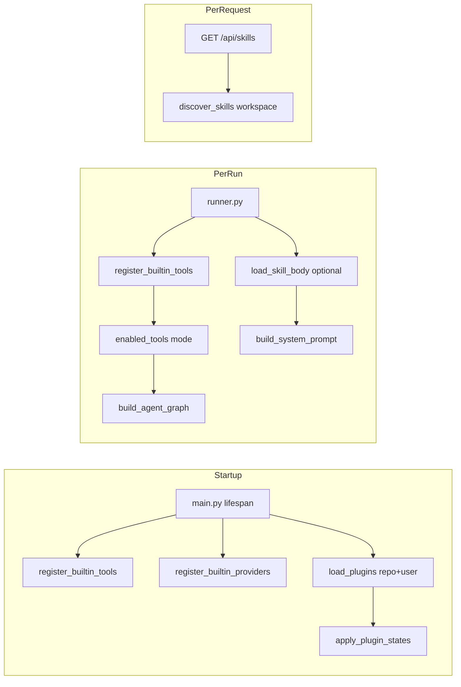

# Code Agent 技术架构方案

> 版本：v1.0 · 2026-08-28  
> 范围：后端 Agent 引擎、流式协议、插件/Skill 扩展、前端工作台、持久化与运维  
> 读者：参与开发、二次集成或架构评审的工程师

---

## 1. 产品定位与设计原则

Code Agent 是一个**开源、无登录、本地优先**的 Web 编码 Agent 工作台，对标 Cursor 类工作流：工作区管理、可停靠多面板 UI、交互式终端、可插拔 Skill/LLM/插件，以及刷新浏览器后仍可续订的流式输出。

| 原则 | 说明 |
|------|------|
| 本地优先 | 默认绑定 `127.0.0.1`；数据落在 `~/.code-agent/data` |
| 双轨持久化 | LangGraph Checkpointer 管**单次 Run 内** ReAct 状态；TortoiseORM 管 UI 历史与事件 |
| UI 协议稳定 | 前端只消费 `RunEvent` SSE；图内部事件经 adapter 转为 `block.*` |
| 扩展友好 | 插件（Python）与 Skill（Markdown）分离；LLM 适配器可注册 |
| 模式分离 | `ask`（只读）/ `plan`（规划）/ `agent`（可写可跑命令） |

---

## 2. 系统架构总览

```
┌─────────────────────────────────────────────────────────────────────────┐
│                         Browser (Vue 3 SPA)                              │
│  Workbench · AgentPanel · Editor · Terminal · Git · Skills · Plugins   │
│       │ EventSource (SSE)          │ REST / WebSocket                   │
└───────┼──────────────────────────────┼──────────────────────────────────┘
        │                              │
        ▼                              ▼
┌───────────────────────────────────────────────────────────────────────────┐
│                    FastAPI (apps/api/code_agent)                           │
│  routers: conversations · runs · workspaces · git · skills · llm · …      │
│       │                                                                    │
│       ├── run_manager.start_run() ──► asyncio Task: _execute()            │
│       │         │                                                          │
│       │         └── run_agent_graph() ──► LangGraph (compile per run)     │
│       │                   │                                                │
│       │                   ├── stream_adapter ──► EventBroker.publish()     │
│       │                   └── checkpointer (AsyncSqliteSaver)               │
│       │                                                                    │
│       └── TortoiseORM ──► code_agent.sqlite3                              │
└───────────────────────────────────────────────────────────────────────────┘
        │
        ▼
  Workspace 本地目录（用户选定的 project root）
  ├── .code-agent/          工作区配置、rules、skills、plugins
  ├── .cursor/skills/       Cursor 兼容 Skill 目录
  └── .agents/skills/       Agents 兼容 Skill 目录
```

### 2.1  monorepo 布局

```
code-agent/
├── Makefile                 # make api / web / build / prod
├── config/default.yaml      # 默认配置
├── apps/
│   ├── api/code_agent/      # Python 后端包
│   └── web/src/             # Vue 3 前端
├── docs/                    # 文档
├── plugins/                 # 内置/示例 Python 插件
├── skills/                  # 内置 Skill（SKILL.md）
└── uploads/                 # 用户上传（图片等）
```

### 2.2 技术栈

| 层 | 技术 |
|----|------|
| 后端 | Python 3.11 · FastAPI · TortoiseORM · LangGraph · LangChain |
| 前端 | Vue 3 · TypeScript · Pinia · dockview · Monaco · xterm.js · TinyRobot |
| 存储 | SQLite（业务 DB + LangGraph checkpoint 分库） |
| 通信 | REST + SSE（Run 事件）+ WebSocket（终端、端口预览） |

---

## 3. 启动与生命周期

### 3.1 开发模式

```bash
make api    # uvicorn 127.0.0.1:4060
make web    # Vite dev 127.0.0.1:4061，/api 代理到 4060
```

### 3.2 生产模式

```bash
make build  # apps/web/dist
make prod   # API 同端口托管静态 UI
```

### 3.3 API 进程 Lifespan（`main.py`）

启动顺序：

1. **Checkpointer** — `AsyncSqliteSaver` → `~/.code-agent/data/langgraph_checkpoints.sqlite3`
2. **TortoiseORM** — `code_agent.sqlite3`，`generate_schemas=True`
3. **register_builtin_providers()** — 内置 LLM 适配器
4. **register_builtin_tools()** — 内置工作区工具
5. **load_plugins()** — 扫描 repo + user 插件目录
6. **apply_plugin_states()** — 从 DB 恢复插件启用状态
7. **upgrade_llm_schema()** — 增量 schema 迁移
8. **_seed_llm_from_env()** — 环境变量种子 Provider

关闭时释放 checkpointer 与 DB 连接。

---

## 4. 配置系统

配置按优先级合并（后者覆盖前者）：

1. `config/default.yaml`
2. `~/.code-agent/config.yaml`
3. `{workspace}/.code-agent/config.yaml`（工作区打开时 reload）
4. 环境变量（如 `CODE_AGENT_PORT`、`CODE_AGENT_DATA_DIR`）

核心配置项（`config/default.yaml`）：

| 键 | 默认值 | 用途 |
|----|--------|------|
| `server.port` | 4060 | API 端口 |
| `server.dev_ui_port` | 4061 | Vite 开发 UI |
| `paths.data_dir` | `~/.code-agent/data` | SQLite、checkpoint |
| `agent.sliding_window_size` | 12 | 热记忆窗口（消息条数） |
| `agent.compress_threshold_tokens` | 90000 | 触发压缩的 token 估计阈值 |
| `agent.max_steps` | 80 | LangGraph recursion_limit |
| `agent.use_legacy_react` | false | 是否回退 prebuilt ReAct |
| `agent.memory.enabled` | true | 结构化工作区记忆 |
| `agent.memory.max_inject` | 10 | 每 run 注入记忆条数上限 |

设置页通过 `/api/settings` 读写部分可 UI 编辑的项（存 `Setting` 表）。

---

## 5. 数据持久化

### 5.1 业务数据库（TortoiseORM）

路径：`~/.code-agent/data/code_agent.sqlite3`

| 模型 | 用途 |
|------|------|
| `Workspace` | 工作区根路径、ignore_globs |
| `Conversation` | 会话；`summary` / `summary_covers_sort_key` 温记忆；`active_run_id` |
| `Message` | UI 消息；`blocks[]` JSON；`sort_key` 排序 |
| `Run` | 单次 Agent 执行；status、model_snapshot、graph_thread_id |
| `RunEvent` | 追加式事件日志（SSE 回放源） |
| `WorkspaceMemory` | 跨会话结构化记忆（kind/subject/content） |
| `LlmProvider` / `LlmModel` | LLM 配置与能力 |
| `PluginState` | 插件启用状态 |
| `TerminalSession` | PTY 会话 |
| `Setting` | 用户设置 KV |

### 5.2 LangGraph Checkpointer

路径：`~/.code-agent/data/langgraph_checkpoints.sqlite3`

- **thread_id**：`{workspace_id}:{conversation_id}`（会话级）
- **作用**：保存单次 Run 执行过程中 `agent ↔ tools` 的 LangChain messages 栈
- **与 UI 分离**：UI 历史来自 `Message` 表；checkpoint 不直接驱动前端

### 5.3 双轨持久化分工

```
┌─────────────────────┬──────────────────────────┬─────────────────────────┐
│ 数据                │ 存储位置                  │ 生命周期                 │
├─────────────────────┼──────────────────────────┼─────────────────────────┤
│ UI 聊天气泡         │ Message.blocks           │ 永久（会话内）           │
│ 流式事件日志        │ RunEvent                 │ 永久；delta 行 run 结束删│
│ ReAct tool 轨迹     │ Checkpointer messages    │ 单次 run 内；下 run 替换 │
│ 长期结构化事实      │ WorkspaceMemory          │ 工作区级跨会话           │
│ 窗口外对话摘要      │ Conversation.summary     │ 会话级                   │
└─────────────────────┴──────────────────────────┴─────────────────────────┘
```

---

## 6. 端到端执行流程

用户发送一条消息的完整路径：

```
1. POST /api/conversations/{id}/messages
      ↓
2. run_manager.start_run()
   · 写入 user Message
   · 创建 Run (queued)
   · conv.active_run_id = run.id
   · asyncio.create_task(_execute)
      ↓
3. _execute(run_id)
   · status → running
   · broker.publish(run.started)
   · run_agent_graph()  [或 legacy ReAct]
   · status → completed / failed / cancelled
   · broker.publish(run.completed|failed|cancelled)
      ↓
4. run_agent_graph()
   · 解析模型、vision、tools、skill
   · build_agent_graph(tools)  ← 每次 run 新建图对象
   · stream_graph_events(graph, input_state, config)
   · 后台 extract_workspace_memories()
      ↓
5. LangGraph 执行
   prepare_context → [compress?] → agent ↔ tools → END
      ↓
6. stream_adapter 监听 astream_events(v2)
   · 仅 agent 节点 LLM 流 → assistant.thinking / assistant.markdown
   · on_tool_start/end → tool.call / tool.result
   · 全部 → broker.publish()
      ↓
7. EventBroker
   · SSE 实时 broadcast
   · block.delta 200ms 批量写 RunEvent + 物化 Message.blocks
   · run 结束删除 block.delta 行
      ↓
8. 前端 subscribeRun(run_id, last_event_id)
   · replay 错过的 events
   · applyEvent() 合并到 messages（delta 用 rAF 节流）
```

### 6.1 Run 状态机

```
queued → running → completed
                 → failed
                 → cancelled
```

取消：`POST /api/runs/{id}/cancel` → `cancel_event.set()` + `run.cancelled`。

---

## 7. LangGraph Agent 图

### 7.1 图结构（`agent/graph.py`）

```
START
  │
  ▼
prepare_context ──needs_compress?──► compress ──┐
  │                              agent ◄───────┘
  │                                 │
  │                    tool_calls?  │
  │                                 ▼
  └────────────────────────────► tools ──► agent (循环)
                                        │
                                        └──► END
```

### 7.2 节点职责

| 节点 | 文件 | 职责 |
|------|------|------|
| `prepare_context` | `nodes/prepare_context.py` | 从 DB 构建 context；**Replace** checkpoint messages |
| `compress` | `nodes/compress.py` | LLM 摘要窗口外消息 → `Conversation.summary`；重建 messages |
| `agent` | `nodes/model.py` | `model.bind_tools(tools).ainvoke(messages)` |
| `tools` | LangGraph `ToolNode` | 执行 tool_calls，返回 ToolMessage |

### 7.3 路由（`agent/routing.py`）

- `route_after_prepare`：`needs_compress` → `compress`，否则 → `agent`
- `route_after_agent`：末条 AIMessage 含 `tool_calls` → `tools`，否则 → `END`

### 7.4 State（`agent/state.py`）

```python
class AgentState(TypedDict):
    messages: Annotated[list, add_messages]  # LangChain 消息栈
    workspace_id, conversation_id, run_id
    mode, thinking_level
    system_prompt, memory_facts, conversation_summary
    needs_compress, token_estimate
    window_message_ids, outside_sort_keys
```

### 7.5 每次 Run 的 Graph 与 Checkpoint 策略

- **Graph 对象**：每次 `build_agent_graph(tools)` 重新 compile（结构相同，非全局单例）
- **Checkpoint thread**：同一会话共用 `{workspace_id}:{conversation_id}`
- **Messages 替换**（方案 A，`agent/messages.py`）：

```python
# prepare_context / compress 返回时：
messages = [RemoveMessage(REMOVE_ALL_MESSAGES), *fresh_from_db]
```

每次 run **开始**时清空 checkpoint 中的旧 messages，注入从 DB 重建的 sliding window；**run 内** agent↔tools 正常 append。避免跨 run 累积 orphan `tool_calls`。

---

## 8. 上下文构建

入口：`context_builder.build_run_context()`（`prepare_context` 调用）

### 8.1 构建步骤

1. 加载会话全部 `Message`，按 `sort_key` 排序
2. **滑动窗口**：默认保留最近 12 条 → `inside`；更早 → `outside`
3. **压缩判定** `needs_compress`：
   - `outside` 中有未被 `summary_covers_sort_key` 覆盖的消息，或
   - `inside` token 估计超过 `compress_threshold_tokens`
4. **记忆检索** `retrieve_memories(workspace_id, user_query)`
5. **系统提示** `build_system_prompt(..., memory_facts, conversation_summary, skill_body)`
6. **LC 消息列表**：

```
[SystemMessage(system_prompt)]
+ history_to_lc_messages(inside)   # HumanMessage / AIMessage（仅 user.text + assistant.markdown）
```

### 8.2 history_to_lc_messages 的限制

- 只把 `user.text`、`assistant.markdown` 转为 LangChain 消息
- **不含** tool.call / tool.result 块（这些只在单次 run 的 checkpoint 内存在）
- 支持 vision：`build_user_content()` 附带图片 block

### 8.3 压缩节点

当 `needs_compress`：

1. 对 `outside_sort_keys` 对应消息调用 LLM 摘要
2. 写入 `Conversation.summary`、`summary_covers_sort_key`
3. 用新 summary 重建 SystemMessage + window messages（同样 Replace checkpoint）

### 8.4 Token 预估

`context_usage.py` 复用同一套 `build_run_context` 逻辑，供发送前「上下文用量」环显示。

---

## 9. 记忆系统

### 9.1 三层记忆

| 层级 | 机制 | 存储 |
|------|------|------|
| 热记忆 | Sliding window（最近 N 条消息） | `Message` 表 + LC messages |
| 温记忆 | 窗口外 LLM 摘要 | `Conversation.summary` |
| 冷记忆 | 结构化工作区事实 | `WorkspaceMemory` |

### 9.2 注入方式

记忆**不**作为独立 HumanMessage，而是写入 **System Prompt** 的 `## Workspace memory (structured)` 段：

```
- [profile] Rick: 用户希望被称呼为 Rick
- [preference] 语言: 优先使用中文回复
```

每 run 的 `prepare_context` 都会重新 `retrieve_memories()`，与 checkpoint Replace 策略配合，保证每轮都注入最新记忆。

### 9.3 检索策略（`memory/retrieve.py`）

1. **始终注入**（最多 5 条）：`profile`、`preference`、`convention`、`goal`、`workflow`
2. **关键词匹配**：用户当前 query 与 subject/tags/statement 打分
3. **兜底填充**：`decision`、`bug_fix`、`lesson` 等至 `max_inject`（默认 10）

作用域：**Workspace 级**，同工作区跨会话共享；不跨 project。

### 9.4 提取策略（`memory/extract.py`）

- **时机**：run 流式结束后 **后台** `asyncio.create_task`（不阻塞 `run.completed`，不在图内节点）
- **管道**：
  1. 启发式（`heuristics.py`）：「我是 Rick 记住我」→ profile
  2. LLM JSON 提取（每 run 最多 `extract_per_run` 条）
  3. 按 `(kind, subject)` 去重 upsert

### 9.5 记忆种类（13 种）

`profile` · `preference` · `goal` · `context` · `workflow` · `decision` · `architecture` · `convention` · `fact` · `bug_fix` · `lesson` · `dependency` · `todo`

API：`GET/PATCH/DELETE /api/workspaces/{id}/memories`  
UI：`MemoryPanel.vue`

---

## 10. 流式事件与 SSE

### 10.1 事件协议（`protocol/events.py`）

```json
{
  "v": 1,
  "event_id": "00000001-abc12345",
  "run_id": "...",
  "ts": "2026-08-28T12:00:00+00:00",
  "type": "block.delta",
  "seq": 1,
  "payload": { "block_id": "...", "text": "..." }
}
```

主要类型：

| type | 含义 |
|------|------|
| `run.started` / `run.completed` / `run.failed` / `run.cancelled` | Run 生命周期 |
| `block.started` | 新块（含 block_type、meta） |
| `block.delta` | 流式文本增量 |
| `block.completed` | 块结束（status: ok/error） |

Block 类型：`assistant.markdown` · `assistant.thinking` · `tool.call` · `tool.result` · `file.diff` · `approval` · `error` · `skill.activated` 等。

### 10.2 EventBroker（`streaming/broker.py`）

| 能力 | 说明 |
|------|------|
| SSE broadcast | 每条事件立即推送到订阅 queue |
| Delta 批量写 DB | 200ms debounce → `RunEvent.bulk_create` + 物化 `Message.blocks` |
| Run 结束清理 | 删除该 run 的 `block.delta` RunEvent 行 |
| Replay | `replay(run_id, last_event_id)` 按 seq 补发 |
| Tail | `GET /api/runs/{id}/events` — replay + live queue |

### 10.3 Stream Adapter（`agent/stream_adapter.py`）

- 监听 `graph.astream_events(..., version="v2")`
- **仅 `agent` 节点**的 LLM 事件推 UI（避免 memory extract 等内部 LLM 泄漏）
- Thinking：按 `thinking_level` 配置输出 `assistant.thinking` 块
- Tools：`on_tool_start` / `on_tool_end` → tool.call / tool.result

### 10.4 前端消费（`stores/app.ts` + `applyEvent.ts`）

- `subscribeRun()` — EventSource 订阅
- `block.delta` — rAF 合并，每帧最多一次 Vue 更新
- `MarkdownBlock` / `ThinkingBlock` — 流式渲染 ~80ms 节流
- `TrajectoryPanel` — `useThrottledTrajectory` 280ms 节流
- ≥40 条消息 — `useVirtualList` 虚拟滚动

刷新续流：加载 DB 已有 `Message`，再以 `last_event_id` 续订 SSE。

---

## 11. 工具系统

### 11.1 内置工具（`tools/host.py`）

| 工具 | 模式 | 说明 |
|------|------|------|
| `read_file` | ask/agent/plan | 读 UTF-8 文本（errors=replace） |
| `list_dir` | 全部 | 列目录 |
| `glob_search` | 全部 | 文件名 glob |
| `grep_search` | 全部 | ripgrep 或 Python 回退 |
| `list_skills` / `load_skill` | 全部 | Skill 发现与加载 |
| `write_file` | agent | 写文件 + diff 事件 |
| `search_replace` | agent | 精确替换 |
| `delete_file` | agent | 删除（需 HITL） |
| `run_command` | agent | Shell（需策略/HITL） |

阻塞 I/O 通过 `asyncio.to_thread`（`async_io.run_sync`）避免阻塞事件循环。

### 11.2 工具上下文

`tools/context.py`：`set_tool_context(run_id, workspace)` — 工具内获取 workspace 根路径、run_id（用于 broker、approval）。

### 11.3 策略引擎（`policy/engine.py`）

- `is_protected(path)` — 禁止写删受保护文件
- `is_command_blocked` / `command_needs_confirm` — 危险命令拦截或确认

### 11.4 Git 工具

通过插件 `plugins/git.py` 注册：`git_status`、`git_diff`、`git_commit` 等；底层 `tools/git_ops.py`。

---

## 12. HITL 人机协同

`tools/approval.py`：

1. 工具调用 `request_approval(tool, summary, details, kind)`
2. Broker 发布 `approval` block
3. 前端展示确认 UI
4. 用户 `POST /api/runs/{id}/approvals/{aid}` → approve/deny
5. 工具 await Event，返回 True/False

用于：`delete_file`、危险 `run_command`、`git_commit` / `git_push` 等。

---

## 13. 插件系统

### 13.1 架构

```
plugins/loader.py  ──scan──►  importlib  ──►  module.register(registry)
                                    │
                                    ▼
                         plugins/base.py :: PluginRegistry (单例)
                           ├── plugins{}    PluginInfo
                           ├── tools{}      ToolSpec
                           ├── providers{}  ProviderSpec
                           └── presets{}    LLM 预设卡片
```

### 13.2 发现路径（优先级从低到高，同 id 后者覆盖）

| 来源 | 路径 | origin |
|------|------|--------|
| 仓库 | `{repo}/plugins/` | repo |
| 用户 | `~/.code-agent/plugins/` | user |
| 工作区 | `{workspace}/.code-agent/plugins/` | workspace * |

\* loader 支持工作区路径，但 **启动时 `load_plugins()` 未传 workspace_root**，工作区插件需在打开工作区后另行加载（当前未 wired）或放 user/repo 目录。

### 13.3 插件形态

**单文件** `my_plugin.py`：

```python
PLUGIN_TITLE = "Hello"
PLUGIN_DESCRIPTION = "..."

def register(registry):
    registry.register_tool(my_tool, source="plugin:hello", modes=("agent",))
```

**目录** `my_plugin/plugin.json` + `plugin.py`（`api` 字段须 ≤ 1）。

### 13.4 内置插件

| 插件 | 内容 |
|------|------|
| `builtin.tools` | `tools/host.py` 注册的核心工具 |
| `builtin_llm` | OpenAI / DeepSeek / Qwen / Ollama 等 7 个适配器 |
| `plugins/git.py` | Git 工具集 |
| `plugins/hello_world.py` | 示例 |

### 13.5 启用状态

- DB 表 `PluginState(plugin_id, enabled, config_json)`
- `PATCH /api/plugins/{id}` 更新内存 registry + 持久化
- `registry.enabled_tools(mode)` — 按 mode、插件/工具 enabled 过滤

### 13.6 LLM 适配器

实现 `LlmAdapter`（`llm/adapters/base.py`），`register_llm_adapter(adapter, kinds=[...])`。

`llm/hub.py`：`resolve_chat_model()` — 按 model_id、thinking_level、vision 需求解析；支持 reasoner↔chat 自动切换、vision 模型自动切换。

---

## 14. Skill 系统

### 14.1 与插件的区别

| | Plugin | Skill |
|---|--------|-------|
| 格式 | Python 代码 | `SKILL.md` + YAML frontmatter |
| 注册 | 启动时 load | 运行时按 workspace 扫描 |
| 作用 | 工具、LLM 适配器 | 领域流程/规范文档 |
| 加载 | 进程内 import | 读文件注入 prompt |

### 14.2 Skill 根目录（优先级从低到高）

| 来源 | 路径 |
|------|------|
| bundled | `{repo}/skills/` |
| user | `~/.code-agent/skills/` |
| cursor | `{workspace}/.cursor/skills/` |
| workspace | `{workspace}/.code-agent/skills/` |
| agents | `{workspace}/.agents/skills/` |

同名 Skill → 高优先级目录覆盖。

### 14.3 SKILL.md 规范

```markdown
---
name: code-review
description: Review code changes for bugs and style issues.
---

# Code Review Skill
...正文...
```

校验：`name` kebab-case ≤64 字符，与目录名一致；`description` ≤1024。

### 14.4 运行时加载路径

1. **System Prompt 列表** — `build_system_prompt()` 嵌入 `Available skills:` 目录
2. **用户 @ 选择** — 消息 meta.skill.name；runner 读 `load_skill_body()` 注入 prompt + 发 `skill.activated` SSE
3. **Agent 自主** — 工具 `list_skills()` / `load_skill()` 按需加载正文

### 14.5 API

- `GET /api/skills?workspace_id=` — 目录列表
- `GET /api/skills/{name}?workspace_id=` — 详情含 body

UI：`SkillsPanel.vue`；编辑器 skill mention 扩展。

---

## 15. 前端架构

### 15.1 布局

- `Workbench.vue` — dockview 停靠面板 shell
- 侧栏活动项切换 Explorer / Agent / Git / Ports 等
- 布局持久化：`PUT /api/layout`

### 15.2 状态管理

单一 Pinia store：`stores/app.ts`

- workspaces / conversations / messages
- fileTree / openFiles / editor
- runStatus / activeRunId
- providers / skills / settings
- sendQueue（运行中排队发送）

### 15.3 消息渲染

- `applyEvent.ts` — 纯函数 reducer，按 block_id 更新
- `renderers/` — 按 block.type 映射组件（MarkdownBlock、ToolCallBlock、FileDiffBlock…）
- `AssistantMessageBody.vue` — 工作过程 vs 最终回答分组；过滤 spurious markdown

### 15.4 性能优化（已实现）

| 层 | 策略 |
|----|------|
| Store | block.delta → rAF 合并 |
| Markdown/Thinking | ~80ms 解析节流 |
| Trajectory | 280ms 节流 |
| AgentPanel | ≥40 消息虚拟滚动 |
| Workbench | 面板懒加载；Vite manualChunks |
| 后端 broker | delta 200ms 批量写 DB |
| workspace/git | blocking I/O → to_thread |

---

## 16. 工作区、Git、端口预览

### 16.1 工作区 API（`routers/workspaces.py`）

文件树、读写、搜索替换、browse/mkdir；路径解析与 `policy` 保护；阻塞 I/O 异步化。

### 16.2 Git API（`routers/git.py`）

status / log / diff / stage / commit / push；mutating 操作可需前端确认。

### 16.3 端口扫描与预览（`ports/`）

- `GET /api/ports` — 扫描本机监听端口（/proc/net/tcp）
- `GET /api/preview/{port}/...` — 反向代理 dev server，注入 URL 重写
- WebSocket 代理 — 支持 Vite HMR
- 受保护端口：4060、4061 + 配置项

---

## 17. 安全说明

- **无认证**：仅限 localhost 使用
- **Agent 可执行 shell**：policy 引擎 + HITL 确认
- **路径保护**：`.git`、`node_modules` 配置等
- **API Key**：`crypto.py` Fernet 加密存 DB

详见 `SECURITY.md`。

---

## 18. 扩展开发指南

### 18.1 新增 Python 插件

1. 在 `plugins/` 或 `~/.code-agent/plugins/` 创建 `my_plugin.py`
2. 实现 `register(registry)` 注册 tool 或 LLM adapter
3. 重启 API；在插件面板启用

### 18.2 新增 Skill

1. 创建 `my-skill/SKILL.md`（frontmatter + 正文）
2. 放入 `skills/` 或工作区 `.code-agent/skills/`
3. 刷新 Skills 面板；Agent 可通过 list_skills 发现

### 18.3 新增 Block 渲染器

1. 后端 broker 发布新 `block_type`
2. 前端 `renderers/` 新增 Vue 组件
3. 在 `renderers/index.ts` 注册 `rendererFor(type)`

### 18.4 调试 Agent

- 日志：uvicorn stdout
- Run 事件：DB `run_events` 表或 SSE 抓包
- Checkpoint：`langgraph_checkpoints.sqlite3`
- Legacy 图：`agent.use_legacy_react: true` 回退 prebuilt ReAct

---

## 19. 关键文件索引

| 模块 | 路径 |
|------|------|
| 应用入口 | `apps/api/code_agent/main.py` |
| Run 生命周期 | `apps/api/code_agent/streaming/run_manager.py` |
| Graph 定义 | `apps/api/code_agent/agent/graph.py` |
| Runner | `apps/api/code_agent/agent/runner.py` |
| 上下文 | `apps/api/code_agent/agent/context_builder.py` |
| Messages 替换 | `apps/api/code_agent/agent/messages.py` |
| Checkpointer | `apps/api/code_agent/agent/checkpointer.py` |
| Stream 适配 | `apps/api/code_agent/agent/stream_adapter.py` |
| EventBroker | `apps/api/code_agent/streaming/broker.py` |
| 记忆 | `apps/api/code_agent/agent/memory/` |
| 插件 Registry | `apps/api/code_agent/plugins/base.py` |
| 插件 Loader | `apps/api/code_agent/plugins/loader.py` |
| Skill Registry | `apps/api/code_agent/skills/registry.py` |
| 内置工具 | `apps/api/code_agent/tools/host.py` |
| DB 模型 | `apps/api/code_agent/db/models.py` |
| 配置 | `apps/api/code_agent/config.py` · `config/default.yaml` |
| 前端 Store | `apps/web/src/stores/app.ts` |
| 事件 reducer | `apps/web/src/protocol/applyEvent.ts` |
| Agent UI | `apps/web/src/panels/AgentPanel.vue` |

---

## 20. 已知限制与演进方向

| 项 | 现状 | 方向 |
|----|------|------|
| Checkpoint SQLite 体积 | 每 step 存快照，可能膨胀 | 定期清理 / 仅保留 latest |
| 工作区插件 | loader 支持但未在打开 workspace 时加载 | wired per-workspace reload |
| Memory 检索 | 关键词 + 规则，无向量 | 可选 embedding 检索 |
| extract_memory | 后台 task，非图节点 | 已与 UI 解耦，文档已同步 |
| 跨 project 记忆 | 不支持 | 按 workspace 隔离为设计选择 |
| compress | 同步阻塞 agent 启动 | 可改后台 compress |

优化路线详见 [optimization-strategy.md](./optimization-strategy.md)。  
需求规格详见 [需求规格说明书.md](./需求规格说明书.md)。

---

## 附录 A：Mermaid — 单次 Run 时序



## 附录 B：Mermaid — 插件与 Skill 加载



---

*本文档随代码演进更新；若与实现不一致，以代码为准。*
